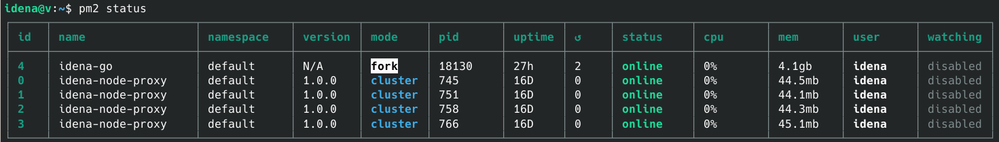

# Idena public shared node setup guide using your own SSL termination



## Introduction
[Idena](https://idena.io) is a Proof-of-Person blockchain. I'm assuming you are familiar with it and with the identity validation process, and have some practical linux command line experience as some of the commands listed in this guide will require modifications before execution. 
In idena, some decide to run a public shared node for their friends and family. Also, if you don't want to run your own idena node or can't due to your internet connection being bad, you can perform validation using public rented nodes for a small iDNA fee. [The idena web app](https://app.idena.io/) used to perform validation requires connecting to public nodes with HTTPS, however the [idena node proxy](https://github.com/idena-network/idena-node-proxy) which is used to open up nodes to many different identities does not support HTTPS. At the time of writing, all public rental nodes available for validation rely on [Cloudflare](https://cloudflare.com) for SSL termination, thus centralizing what is supposed to be decentralized, the node itself in the background is still decentralized of course, but the humans connecting to validate their identities are connecting to a centralized endpoint, albeit with some geographic distribution. Also, the data between cloudflare and the actual node proxy is not even encrypted, only the connection between the human and Cloudflare is, which is bad. The official idena public nodes used for validating candidates seem to be using nginx proxying for SSL termination. I've decided to use HAProxy as a simpler and more lightweight solution since I don't need a full-blown web server and resources on a VPS are tight.

This guide is for setting up your own public shared node with your own domain and a [Let's Encrypt](https://letsencrypt.org/) SSL certificate on a VPS, but **without** relying on cloudflare for SSL termination. As a starting guide, I have used some of the already existing guides such as Rioda's [Shared node setup on VPS](https://idena.site/faq.php#shared-node-setup-on-vps) and Mahmoud's original guide from the now defunct idena forum, [Running your own shared node step by step tutorial](https://discuss.idena.site/d/36-running-your-own-shared-node-step-by-step-tutorial), but I've done quite a few things differently.

The general idea here is: idena web client -> HAProxy HTTPS -> idena-node-proxy -> idena-go (node)

-------
## Step 1: preparation

These instructions are for Debian 10, other distros have not been tested. I'm using Debian 10 on a VPS with 4 vCores, 8GB RAM and 100GB SSD storage. 

* (optional) Most VPSs don't come with swap enabled, but I created 4GB swapfile which will act as RAM fallback in case I ever run out of the available 8GB, this will prevent the system from killing processes, of course things will slow down but its better to have additional "RAM" even if its at SSD speeds than to have killed processes.
```
sudo fallocate -l 4G /swapfile
sudo chmod 600 /swapfile
sudo mkswap /swapfile
sudo swapon /swapfile
echo '/swapfile none swap sw 0 0' | sudo tee -a /etc/fstab
```
* To increase maximum number of open file descriptors edit /etc/security/limits.conf and add to the end `* - nofile 64000`

* install some basic needs: `sudo apt install screen git curl wget unzip`

* Install nodejs and npm, needed for idena-node-proxy. I used the [official instructions to install novejs v16](https://github.com/nodesource/distributions/blob/master/README.md)

* Install pm2, a daemon process manager: `sudo npm i -g pm2`

* (optional) Create a separate user for the idena node: `sudo useradd -m -s /bin/bash -G sudo idena`. You can now ssh to your VPS as this user or use 'sudo su - idena' to switch to it from your current user, do this preferably inside a screen session so you can use both your original VPS username and the idena one in separate screen windows.

---

## Step 2: install idena-go, the idena node

1. When youre at the shell prompt for the user that you wish to install [the node](https://github.com/idena-network/idena-go/releases) on, do the following:

```
cd ~
mkdir idena-node && cd idena-node
```
get the newest linux node by copying the link to it from https://github.com/idena-network/idena-go/releases and using wget. Then edit the following code block to reflect the version that you downloaded before using the commands:
```
ln -s idena-node-linux-0.27.0 idena-go
chmod u+x idena-node-linux-0.27.0
echo "{\"IpfsConf\":{\"Profile\": \"server\" ,\"FlipPinThreshold\":1}}" > config.json
mkdir datadir && cd datadir
mkdir idenachain.db && cd idenachain.db
wget https://sync.idena.site/idenachain.db.zip
unzip idenachain.db.zip && rm idenachain.db.zip
```

2. create/edit the api.key file in the node's datadir with the api key you wish to use, this API key will be used to connect idena-node-proxy with the node.
We can use a command that is already provided with linux to create an API key with 32 hexadecimal characters: `hexdump -n 16 -e '4/4 "%08X" 1 "\n"' /dev/urandom | awk '{print tolower($0)}'`

3. Since we are using pm2 process manager for idena-node-proxy, we can also use it for the node instead of using messy screen sessions, this will take care of automatically starting the node on system boot and restarting it if it crashes.

to start your node using pm2:

```
cd ~/idena-node
pm2 start idena-go -- --config=config.json --profile=shared
```

now our node is running in the background, you can follow its output by using ```tail -f ~/idena-node/datadir/logs/output.log``` or `pm2 monit`

---

## Step 3: install idena-node-proxy

The idena node proxy will allow many identities to acess our node for verification using unique API keys for each identity. To install:

```
cd ~
git clone https://github.com/idena-network/idena-node-proxy
cd idena-node-proxy
```

Because I will be using HAProxy for SSL termination I want to edit the proxy so it only listens on localhost and is not accessible directly from the internet. To do this, in the idena-node-proxy directory, edit index.js and go to the very last line, which should be edited to look like this:

```
app.listen(parseInt(config.port), 'localhost');
```

Now the proxy will only listen on localhost, and thus you can only access it via an SSH tunnel or by using a proxy like the HAProxy we will install in a later step.

copy config_default.json to config.json and edit it:

Under node you must enter the URL of your local idena-go node and its api key which you configured in step 2 of this guide:

    "node": {
        "url": "http://localhost:9009",
        "key": "1234abcd"

This is optional, but under logs change the output to file to make it easier to follow connections to the idena-node-proxy:

    "logs": {
        "output": "file",

You will also need to add API keys for those who will connect to your shared node, each identity connecting should have their own apikey, these are edited in the config file as for example:

```
"apiKeys": ["12345","67890","abcde"],
```
Every time you need to change/add more api keys for users, you can do so by editing the config file. When you have updated and saved the file, you need to restart the idena proxy for the new API keys to become usable, to do so just run `pm2 restart idena-node-proxy` from the linux user under which the proxy is installed.

After editing everything, while still in the idena-node-proxy directory, run:

```
npm install
(I got a message here that there is a high severity vulnerability and to run 'npm audit fix' and so I did)
npm start
```

if the idena proxy doesnt start and in the pm2 error logs you see something like "Error: bind EACCES" it means the proxy could not bind to the configured port, something else might be running on that port.

once both the node and proxy are running, run `pm2 startup` and follow the instructions to have the pm2 daemon start on boot, then run `pm2 save` to save what is currently running under pm2, which means it will start both the node and the proxy on every boot.

**pm2 cheat sheet**:

```
pm2 logs are located in ~/.pm2/logs
to check status of services running under pm2: pm2 status
to live-monitor services running under pm2: pm2 monit
to restart the proxy: pm2 restart idena-node-proxy
to restart the node: pm2 restart idena-go
to shut down the node completely: pm2 delete idena-go
to start the node again: pm2 start idena-go -- --config=config.json (must be in directory where idena-go is located)
to shut down the proxy completely: pm2 delete idena-node-proxy
to start the proxy: npm start (must be in idena-node-proxy directory)
```

---

## Step 4: Acquire Let's Encrypt SSL certificate

You need a real domain name and you also require a valid SSL certificate in order for your node to work with the idena web app. Let's Encrypt has become ubiquitus and there are many guides and [ACME client implementations](https://letsencrypt.org/docs/client-options/) to make things simple.

However I am not using any of that at the moment because my domain registrar provides me with a wildcard SSL certificate for my use. This is not ideal as I have to manually download this certificate from their website every time the certificate expires (every 90 days) and manually replace it on the VPS. I will change this at a later date so the SSL certificates gets updated automatically on the VPS itself, and then I will update this guide. The guide I will use for this is [LetsEncrypt with HAProxy](https://serversforhackers.com/c/letsencrypt-with-haproxy)

---

## Step 5: install HAProxy reverse proxy

Install the newest LTS version of HAProxy by using [Debian/Ubuntu HAProxy packages](https://haproxy.debian.net/)

Once installed, its configuration file is located at /etc/haproxy/haproxy.cfg and at the end of this file you should add something like the following, changing everything appropriately:

```
frontend www-http
        bind PUBLIC_IP_OF_VPS:80
        bind PUBLIC_IP_OF_VPS:443 ssl crt /etc/ssl/mydomain.com/mydomain.com.pem
        # redirects HTTP to HTTPS
        http-request redirect scheme https unless { ssl_fc }

        # HSTS setup, max-age is mandatory, 16000000 seconds is a bit more than 6 months
        http-response set-header Strict-Transport-Security "max-age=16000000; includeSubDomains; preload;"
        default_backend idena-node

backend idena-node
        server idenaproxy 127.0.0.1:3000 check
```

to reload the configuration run ``sudo systemctl reload haproxy``

to view HAProxy status do ``haproxy -vv``

For the most part I used this guide to figure things out: [HAProxy SSL Termination](https://www.haproxy.com/blog/haproxy-ssl-termination/)

---

## Bonus 1: Updating your node

The quick and dirty:
```
- go to the idena-node folder
- wget the newest version
- rm the idena-go symlink
- give execute permissions to the newly downloaded node: chmod u+x idena-node-linux-0.27.0
- add a symlink to the new version: ln -s idena-node-linux-0.27.0 idena-go
- run pm2 restart idena-node
- keep the old version in case you need to revert to it, or delete it
- you can change the symlink to the version you want to run without having to modify pm2, just run the restart command after changing the symlink and the node version that the symlink is pointing to will run.
- Only if there has been a change in the command line to start the idena node, such as with v0.27.0, you must run pm2 save for pm2 to remember this change for future restarts and for running at boot.
```

---

## Bonus 2: node performance and node log parsing

For my very first validation, I provided 120 keys so 120 humans could validate. In the end I validated a total of 30 humans, and it appears all of them validated successfuly using my public rental node.

For the 2nd validation, I provided 200 keys and in total I validated 130 humans, I am writing a script to parse log files and create statistics for each validation.

From watching the resource usage while validation was ongoing (after finishing my own validation of course), idena-go node is definitely the most resource hungry, on the other hand HAProxy and idena-node-proxy don't use any significant resources at all. I'm fairly confident I could easily increase my slots somewhat on my current VPS.

I've created a log parser to get some useful statistics from your node after a validation, more information at [idena-node-proxy validation log parser](https://github.com/pocoloko/idena-node-proxy-logparser)

~~It is recommended to restart the node often as it tends to hog up RAM, so I would set up a cron job under the user where the node is installed to run `pm2 restart idena-go` at a convenient time every 24hrs or so.~~ The newer node versions do not hog as much RAM and seem to hover steadily around 4GB usage, but if you wish you can still restart your node every once in a while.

---

## Bonus 3: creating lists of api keys for rental nodes

If you're going to run a public rental node and not just a small shared node for friends and family, you need to create a lot of api keys for each separate validation, then you need to configure these api keys in your idena-node-proxy configuration file, and then send them to the admins of idena for your node to show up on the rental page in the idena web app. We are going to use the same linux command to create the apikeys as in Step 2 to create the node api key.

I wrote a simple shell script that generates the api keys for you, it is available [here](https://github.com/pocoloko/idena-shared-node/blob/main/apikeys.sh) but read on if you want to understand how it works:

1. To create API keys, change 150 to the number of API keys you want to create:
```
for i in {1..150}; do hexdump -n 16 -e '4/4 "%08X" 1 "\n"' /dev/urandom | awk '{print tolower($0)}'; done > keys.txt
```

2. now we have our key list in a file, next we will put the keys in between double quotes and add a comma after each, this will make them easier to insert into the configuration file:
```
sed 's/.*/"&",/' keys.txt > keys2.txt
```

3. now we'll remove each newline and save to the finished file.
```
sed -z 's/\n//g' keys2.txt > keysconfig.txt 
```
4. now the contents of the keysconfig.txt file are ready to be pasted manually into the idena-node-proxy config file in the appropirate place, after which the proxy should be restarted for the keys to become active. You can repeat this process for however many validations you are configuring ahead of time.

5. Next to also prepare the keys for the idena devs so they can include them in the rental node list, we add the current epoch to the end of each key in the original apikey file that we made in the 1st step, and send this to the admins, edit the number 71 to the current epoch:
```
sed s/$/,71/ keys.txt > keysdevs.txt
```

## Bonus 4: monitoring your node remotely

A Python script to watch the node and send an e-mail if its down. Check it out: [remote monitor for idena public shared node](https://github.com/pocoloko/idena-shared-node-monitor)

---
Found this guide useful? I accept iDNA donations to address `0x8dc26a6fbdbe2fdb8b5284ab55f56e720b3c42ad`
